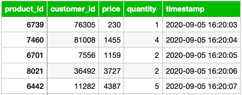
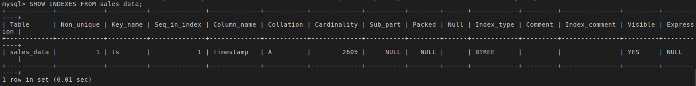

# Setting up MySQL as an OLTP database for e-commerce organization "SoftCart"

## Database design

I've been provided only with the following sample data:



Using the sample data, I've decided to use following data types for columns:

- int for "product_id"
- int for "customer_id"
- decimal (6,2) for "price" (we need fixed-precision data type for prices)
- smallint for "quantity"
- timestamp for "timestamp"

I'm creating a database named "sales" with a table named "sales_data" using SQL statements inside MySQL CLI:


## Loading data

I've been provided with a .csv file containing practice data.

I'm importing this data using phpMyAdmin interface:


## Additional tasks

### List tables in database "sales" using MySQL CLI


### Write a query to find out the count of records in the table "sales_data"


### Set up administrative tasks

1. Create an index 'ts' on timestamp field
   
    

2. List indexes
   
   

3. Write a bash script to export data
   
   The exercise required easy script without additional precautions (moving credential information to separate file, etc.).

   ```sh
   #!/bin/sh
   
   # Setting variables
    DATABASE='sales'
    TABLE='sales_data'
    FILENAME='sales_data.sql'
   
   # Exporting rows to sales_data.sql
    echo "Exporting all rows from sales_data table to sales_data.sql"

    if mysqldump -uroot -pODc2Ni1uaWtva29s $DATABASE $TABLE > $FILENAME;
    then
        echo "Export to sales_data.sql successful"
    else
        echo "Export to sales_data.sql unsuccessful"
        exit
    fi
    ```
    
    Script output:

    