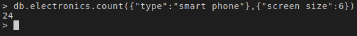

# Setting up MongoDB as a NoSQL database for e-commerce organization "SoftCart"

"SoftCart" plans to use MongoDB to store the e-commerce catalog data.

Data is provided as "catalog.json" file.

## Importing data

## Additional tasks

### Setting up mongoimport and mongoexport tools

### List all databases

### List all collections in the database "catalog"

### Create an index on the field “type”

### Write a query to find the count of laptops

### Write a query to find the number of smartphones with screen size of 6 inches

### Write a query to find out the average screen size of smartphones in catalog

### Export the fields _id, “type”, “model”, from the ‘electronics’ collection into a file named electronics.csv

