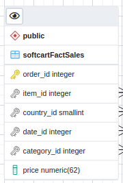
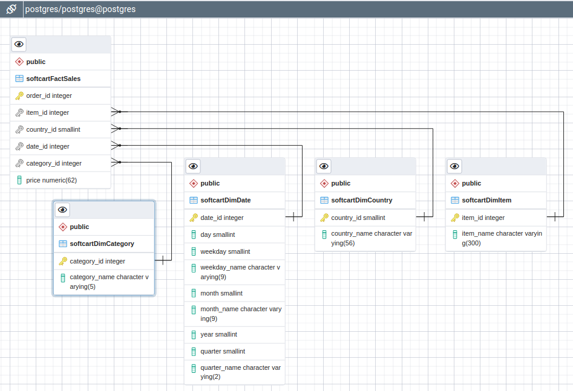

# Implementing a data warehouse for "SoftCart"

SoftCart has international presence and customers from all over the world, and deals in e-books, movies and songs (streaming and downloads).

The company would like to create a data warehouse so that it can create the following reports:

- total sales per year per country
- total sales per month per category
- total sales per quarter per country
- total sales per category per country

SoftCart has provided sample data:

## Designing a star schema

### Designing dimension table softcartDimDate

SoftCart's requirements for reports state a granularity of a day.

Therefore, dimension table for date and its parts will include day, day of the week, weekday number, month, name of the month, year, quarter and name of the quarter.

### Designing dimension table softcartDimCategory

Judging by sample, we have only 3 categories: "Movie", "Ebook" and "Song".

Therefore, dimension table will look like this:

### Designing dimension table softcartDimItem

Sample data has movies, songs and ebooks in it.

Interestingly, the longest book title is currently at 27,978 characters!

But I think that in absence of detailed information I will stop at 300 characters for "item_name", which will hold the longest song title, all movie titles and 99% of book titles out there.

### Designing dimension table softcartDimCountry

### Designing fact table softcartFactSales

### Setting up relationships

### Generating SQL script from ERD tool

[ERD-to-SQL-generated-schema.sql](ERD-to-SQL-schema.sql)

### Creating schema in new database named "staging" using generated SQL script

