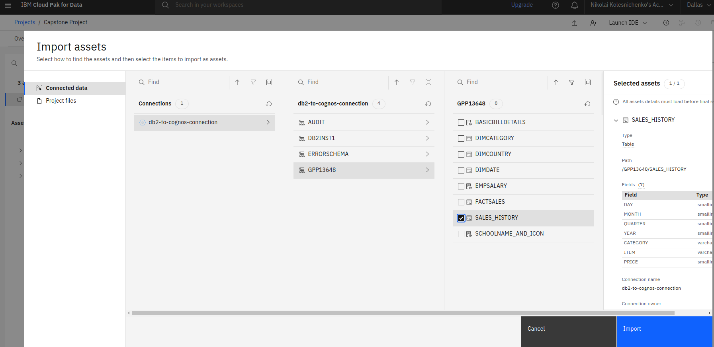
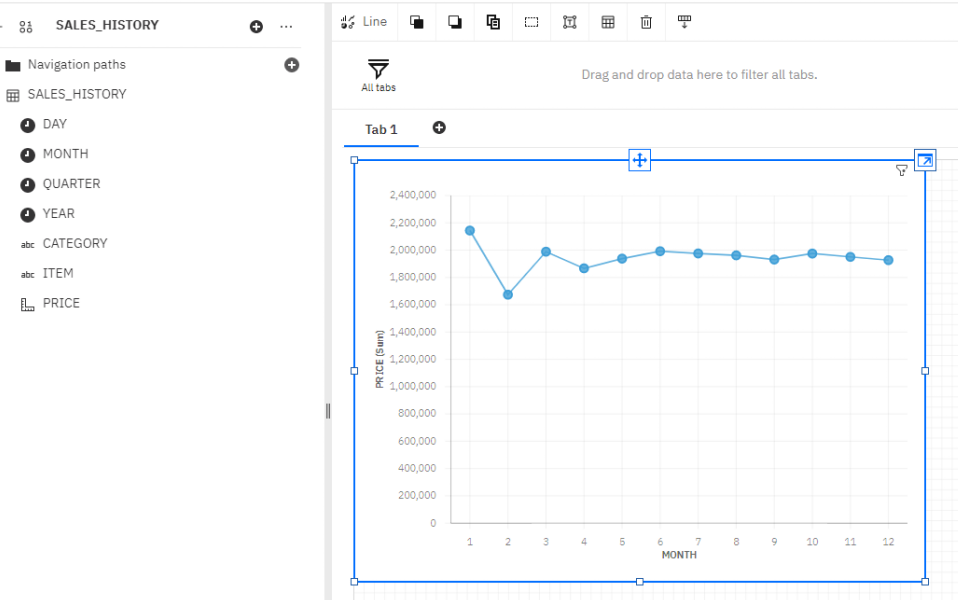
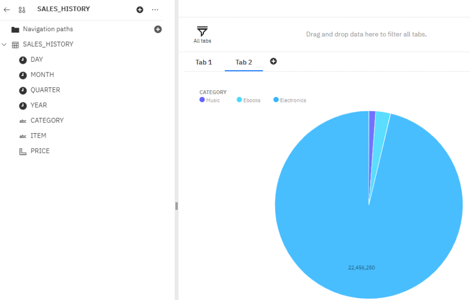
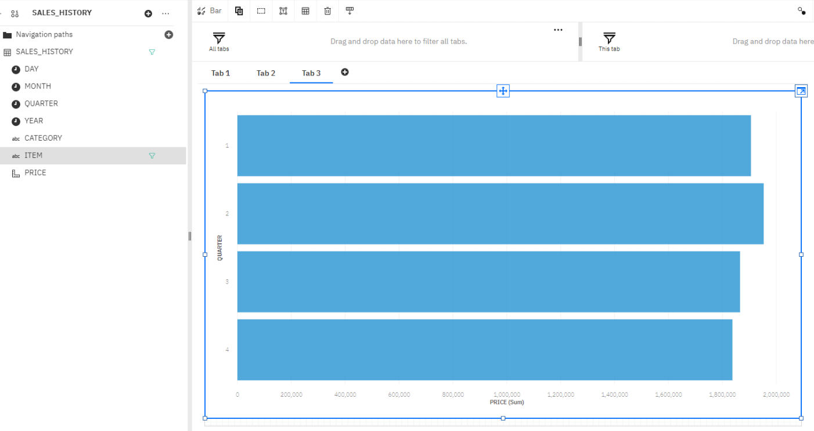

# Creating a dashboard using Cognos Analytics

SoftCart has finished setting up a data warehouse.

Now I am assigned the responsibility to design a reporting dashboard that reflects the key metrics of the business.

## Tasks

### Create a data source in Cognos that points to the table sales_history in your IBM DB2 database

### Create a line chart of month wise total sales for the year 2020

### Create a pie chart of category wise total sales

### Create a bar chart of quarterly sales of mobile phones

